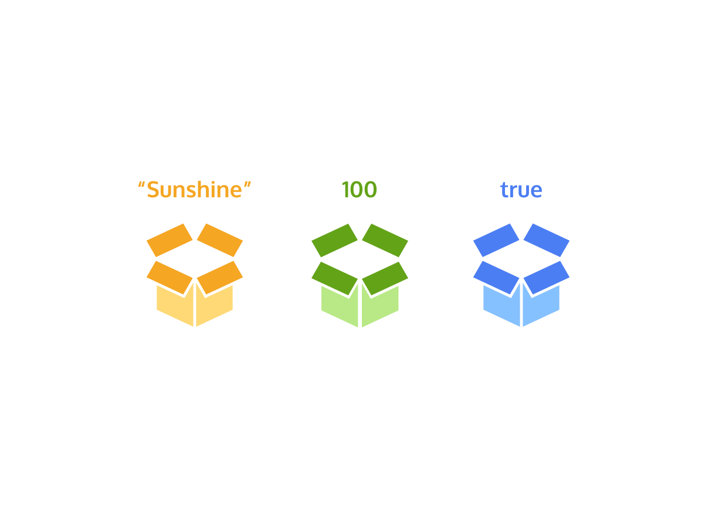

# Variables



A variable is a container for a value.

Variables allow developers to label and store data in the computer memory, so they can reference or get that information later on in the program.

**How to create a variable?**

Prior to ES6, the only way to create (declare) a variable was to use the `var` keyword

```js
var myName = 'Arya'
```

ℹ️ About the assignment operator

`=` is the assignment operator. It assigns the value ('Arya') to the variable (myName).

_technical communication_ :

`" We declared the variable myName, which is initialized with a value of 'Arya' "`.

Since ES6 was introduced, the `let` keyword is the preferred way to declare a variable when it can be reassigned a different value.

```js
let accountBalance = 0
console.log(accountBalance) // Output: 0

accountBalance = 1000000
console.log(accountBalance) // Output: 1000000
```

ℹ️ About (console.log)

Much of the work the computer does with our code is invisible to us by default. If we want to see things appear on our screen, we can print, or log, to our console (a panel that displays messages) directly.
the `console` keyword followed by `.log()` is the way we print, or log, to the console.

ℹ️ About (variable reference)

We can reference a variable in our program by using the variable name: console.log(accountBalance).

**⚠️ IMPORTANT ⚠️: if we don’t assign a value to a variable declared using the `let` keyword it will be automatically initialized with a value of `undefined`:**

```js
let meal // Output: 0

meal = 'salad'
console.log(meal) // Output: 'salad'
```

The `const` keyword is the preferred way to declare a variable when it doesn't need to be reassigned a different value later on.

```js
const numberOfLegs = 2
```

**⚠️ IMPORTANT ⚠️: declaring a const variable without a value, results in a `SyntaxError.`**

```js
const numberOfLegs;
console.log(numberOfLegs) // Output: 'SyntaxError: Missing initializer in const declaration'
```

The `typeof` operator returns the data type (as a string) of a value.

**What is the type of the value stored in the variable named `v`?**

```js
let v
typeof v // Output: undefined

v = '1'
typeof v // Output: string

v = 2
typeof v // Output: number

v = true
typeof v // Output: boolean

v = {}
typeof v // Output: object

v = Symbol()
typeof v // Output: symbol

v = null
typeof v // Output: object (*JS bug)

v = function () {}
typeof v // Output: function

v = [1, 2, 3]
typeof v // Output: object
```
